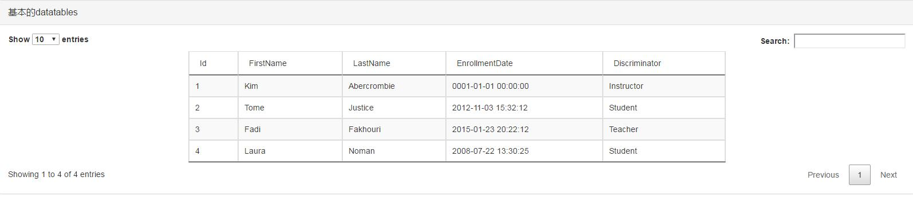

# jQuery Datatables学习笔记

## 前言

jQuery 的插件 dataTables 是一个优秀的表格插件
提供了针对表格的排序、浏览器分页、服务器分页、筛选、格式化等功能。
[dataTables](https://www.datatables.net/) 的网站上也提供了大量的演示和详细的文档进行说明，为了方便学习使用，这里一步一步进行说明。

这里演示的是datatables与bootstrap3配套使用示例。
## 1、下载datatable插件

官方下载地址:
	[https://www.datatables.net/download/index](https://www.datatables.net/download/index)

目前最新版本是1.10.15，jQuery版本是1.12.0

## 2、引入文件
a. 引入css文件


```
    <link rel="stylesheet" href="css/bootstrap.min.css" />
    <link rel="stylesheet" href="css/jquery.dataTables.min.css" />
```
b. 引入js文件
```
    <script type="text/javascript" src="js/jquery.js"></script>
    <script type="text/javascript" src="js/jquery.dataTables.min.js"></script>
    <script type="text/javascript" src="js/bootstrap.min.js"></script>
```
**注意点：**

	
* 因为DataTable和Bootstrap依赖于JQuery，所以在引入DataTables和Bootstrap的JS文件之前，需要先引入JQuery文件：jquery.js

## 3、用法
### 使用datatables插件，咱们先要有一个表格

```
<div class="panel panel-default">
    <div class="panel-heading">
        <div class="panel-title">
            基本的datatables
        </div>
    </div>
    <div class="panel-body">
        <table id="example" class="table table-bordered table-striped table-hover">
            <thead>
                <tr>
                    <td>Id</td>
                    <td>FirstName</td>
                    <td>LastName</td>
                    <td>EnrollmentDate</td>
                    <td>Discriminator</td>
                </tr>
            </thead>
            <tbody>
                <tr>
                    <td>1</td>
                    <td>Kim</td>
                    <td>Abercrombie</td>
                    <td>0001-01-01 00:00:00</td>
                    <td>Instructor</td>
                </tr>
                <tr>
                    <td>2</td>
                    <td>Tome</td>
                    <td>Justice</td>
                    <td>2012-11-03 15:32:12</td>
                    <td>Student</td>
                </tr>
                <tr>
                    <td>3</td>
                    <td>Fadi</td>
                    <td>Fakhouri</td>
                    <td>2015-01-23 20:22:12</td>
                    <td>Teacher</td>
                </tr>
                <tr>
                    <td>4</td>
                    <td>Laura</td>
                    <td>Noman</td>
                    <td>2008-07-22 13:30:25</td>
                    <td>Student</td>
                </tr>
            </tbody>
        </table>
    </div>
</div>

```
**注意点：**
* 对于 dataTables 来说，表格必须通过 thead 和 tbody 进行说明，否则会出现问题；


a. 最简单的使用方式,就是零配置的方式。
```
$(document).ready(function() {
 	$("#example").dataTable();
});
```
效果如图：



b.一个简单实用的Demo

```
<script type="text/javascript">
        $(function () {
            $("#example").dataTable({
                //lengthMenu: [5, 10, 20, 30],//这里也可以设置分页，但是不能设置具体内容，只能是一维或二维数组的方式，所以推荐下面language里面的写法。
                paging: true,//分页
                ordering: true,//是否启用排序
                searching: true,//搜索
                language: {
					//左上角的分页大小显示
                    lengthMenu: '<select class="form-control input-xsmall">' + '<option value="1">1</option>' + '<option value="10">10</option>' + '<option value="20">20</option>' + '<option value="30">30</option>' + '<option value="40">40</option>' + '<option value="50">50</option>' + '</select>条记录',
					
					//右上角的搜索文本，可以写html标签
                    search: '<span class="label label-success">搜索：</span>',

					//分页的样式内容
                    paginate: {
                        previous: "上一页",
                        next: "下一页",
                        first: "第一页",
                        last: "最后"
                    },

					//table tbody内容为空时，tbody的内容
                    zeroRecords: "没有内容",

                    //下面三者构成了总体的左下角的内容
					//左下角的信息显示，大写的词为关键字
                    info: "总共_PAGES_ 页，显示第_START_ 到第 _END_ ，筛选之后得到 _TOTAL_ 条，初始_MAX_ 条 ",
					
					//筛选为空时左下角的显示
                    infoEmpty: "0条记录",

					//筛选之后的左下角筛选提示
                    infoFiltered: ""
                },
                paging: true,
                pagingType: "full_numbers",//分页样式的类型

            });
            $("#example_filter input[type=search]").css({ width: "auto" });//右上角的默认搜索文本框，不写这个就超出去了。
        });

    </script>


```